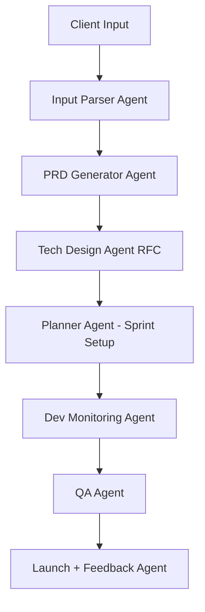

# Autonomous Web Development Workflow with AI Agents

This repository outlines a structured approach to running a web development agency using **AI Agents** to reduce human-in-the-loop involvement. It combines Product Requirements (PRD), Technical Design (RFC), Sprint Planning, QA, and Deployment into a streamlined autonomous system.

---

## 🌐 Overview
This system leverages AI agents to handle:
- Parsing client input
- Drafting PRDs and RFCs
- Creating tickets and planning sprints
- Monitoring dev work
- Automating QA and deployment

The architecture can be implemented with frameworks like **LangChain**, **CrewAI**, or **AutoGen**, and integrated with tools like Notion, GitHub, Linear, and Slack.

---

## 🧠 Agent Workflow Diagram

---

## 🧩 Agent Roles

### 1. Input Parser Agent
- Parses raw inputs (email, form, transcript)
- Extracts structured scope, goals, features

### 2. PRD Generator Agent
- Generates Product Requirements Document from parsed inputs
- Adds use cases, constraints, and goals

### 3. Tech Design Agent (RFC)
- Writes technical design document
- Outlines architecture, tools, tradeoffs

### 4. Planner Agent
- Breaks down PRD + RFC into dev tasks
- Assigns to frontend/backend/devops

### 5. Dev Monitoring Agent
- Tracks PRs, build pipelines, stuck reviews
- Sends Slack alerts for issues

### 6. QA Agent
- Maps test cases to PRD
- Runs automated or manual tests

### 7. Launch + Feedback Agent
- Deploys final product
- Sends release notes and collects client feedback

---

## 🧪 Example Tools
| Layer | Tools |
|-------|--------|
| Agent Orchestration | LangChain, CrewAI, AutoGen |
| Integration | Zapier, n8n, Slack, GitHub, Linear |
| Hosting | Vercel, Modal, Fly.io |
| RAG/Memory | Pinecone, Weaviate |

---

## 📌 Getting Started
To run your first agent-based flow:
1. Define client intake and auto-parse with Input Parser Agent
2. Generate a PRD with prompt engineering or fine-tuned LLM
3. Expand into RFC and use planner logic to create sprint tickets

Stay tuned for templates, agent code, and deployment instructions.

---

## 💬 Contributing
Pull requests welcome. For major changes, please open an issue first.

---

## 📜 License
MIT
